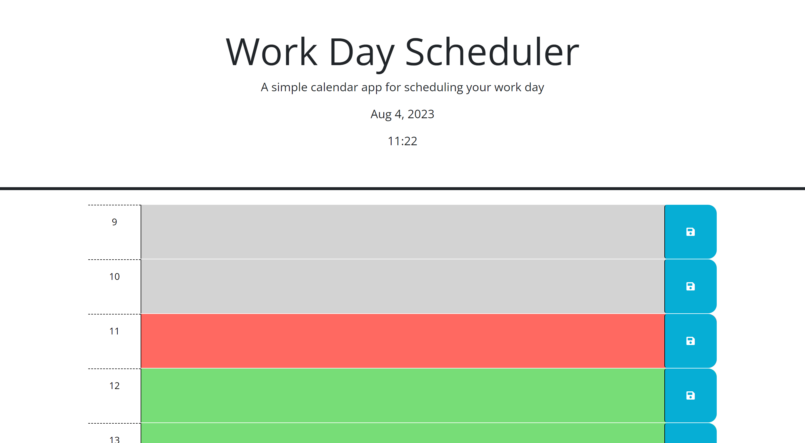
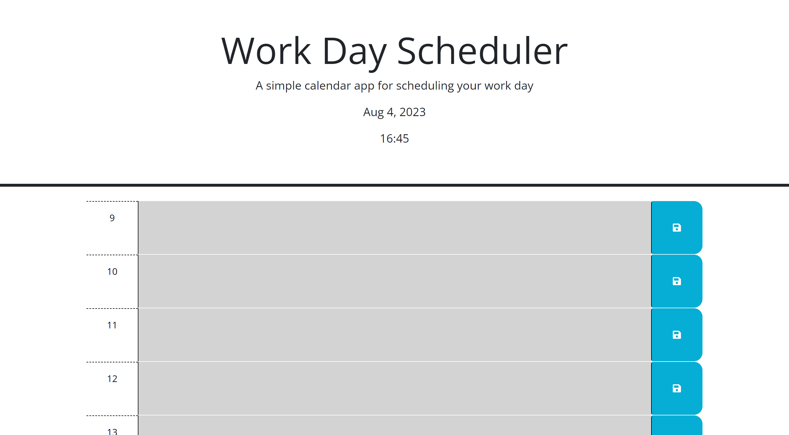
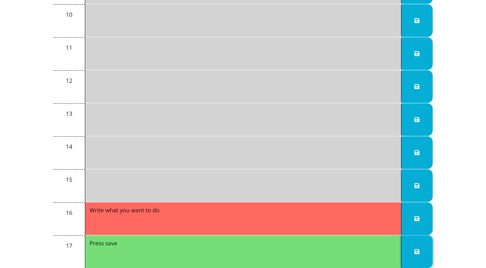
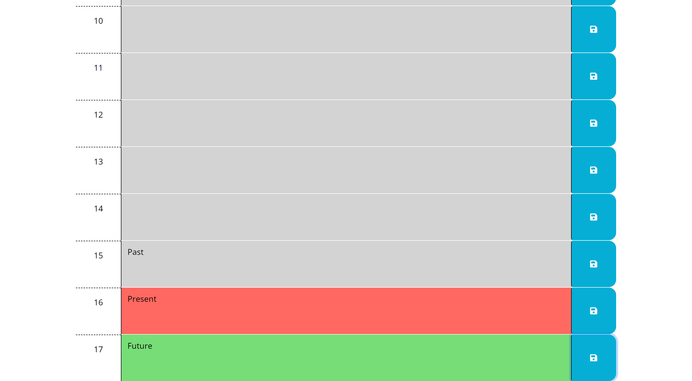

# Schuper Duper Work Day Scheduler

## Description

A simple timeblock work day scheduler, to help you plan out your day.  Written using jquery and dayJS.

## Installation

Please visit 
[https://poisoned-eden.github.io/schuper-duper-day-scheduler/](https://poisoned-eden.github.io/schuper-duper-day-scheduler/) to use.

## Usage

The scheduler displays hourly timeblocks for 09:00 - 18:00.

Schedule what you want into those blocks by entering text in the row you'd like.

Press the save button for that row and it will be saved to your browsers local storage.

On refresh of the page, your previously saved information will be displayed in the rows.

The colours of the rows change depending on the time.  Grey shows past blocks.  Red is the current timeblock. Green is in the future.

## Licence

## Credits

Starter code for this coursework challenge was provided by the University of Birmingham and EdX.

## Badges

